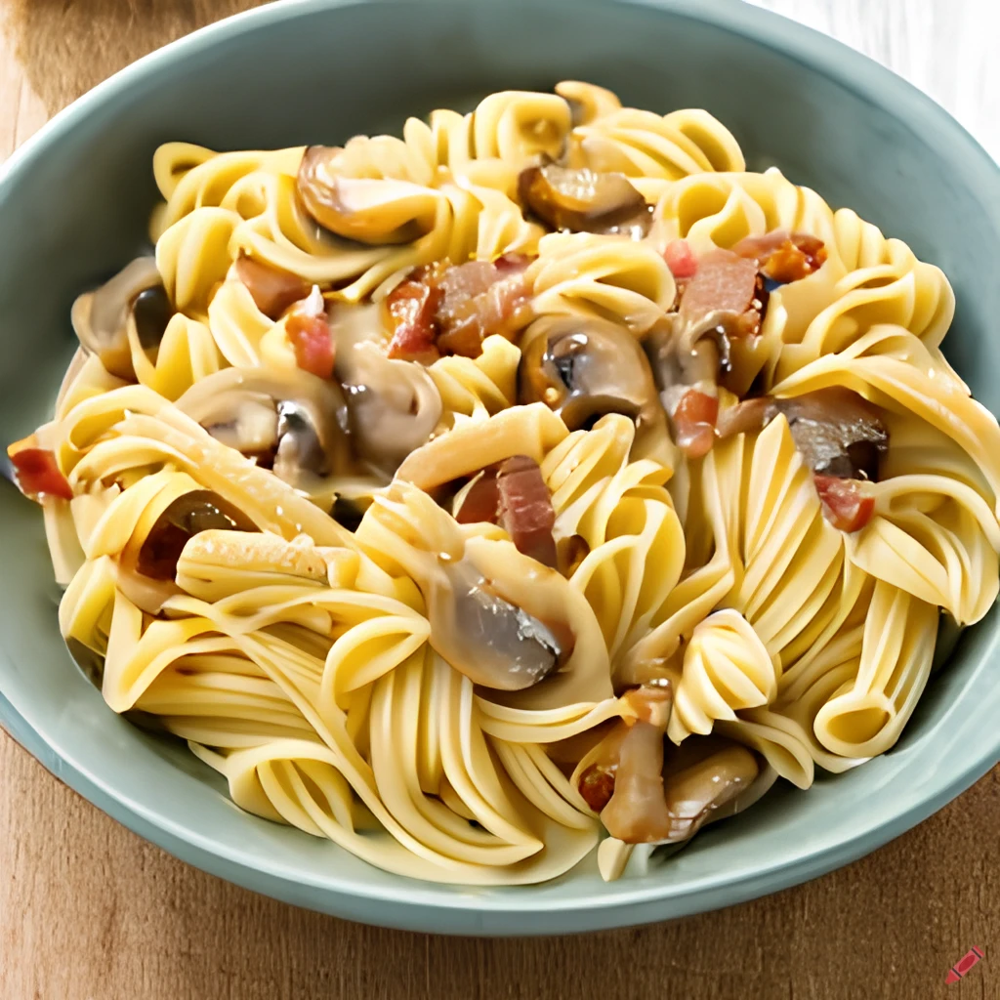

Satisfy your cravings with this delicious and savory bacon and mushroom pasta recipe. The dish perfect for a cozy weeknight dinner. Easy to make and packed with flavor, this dish is sure to become a family favorite!

## Ingredient

* 100 g penne pasta
* 100g pack chestnut or button mushrooms, wiped clean
* 1 rashers streaky bacon
* 1 tbsp pesto (fresh from the chiller cabinet if possible)
* 50 ml carton 50% fat crème fraîche
* Handful basil leaves

## Method

STEP 1: Cook the pasta in boiling water in a large non-stick saucepan according to pack instructions. Meanwhile, slice the mushrooms and snip the bacon into bite-size pieces with scissors or a sharp knife.

STEP 2: Reserve a few drops of the cooking water in a cup or bowl, then drain the pasta and set aside. Fry the bacon and mushrooms in the same pan until golden, about 5 mins. Keep the heat high so the mushrooms fry in the bacon fat, rather than sweat.

STEP 3: Tip the pasta and reserved water back into the pan and stir over the heat for 1 min. Take the pan off the heat, spoon in the pesto and crème fraîche and most of the basil and stir to combine. Sprinkle with the remaining basil to serve.