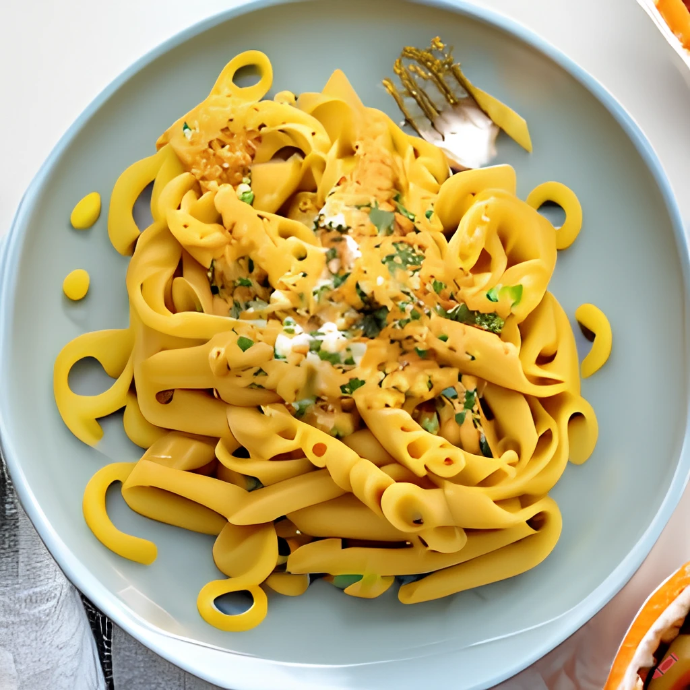

Get ready for a cozy fall-inspired meal with this creamy pumpkin pasta recipe. This dish is perfect for a chilly evening in. Plus, it's easy to make and sure to impress your taste buds!

## Ingredients

* 1 tbsp olive oil
* 1 onion, finely chopped
* 1 garlic clove, crushed
* 125 g pumpkin or squash, peeled and cut into roughly 3cm cubes
* 50 whole milk
* 1 tbsp tomato purée
* 1 tbsp mascarpone
* 100g short pasta (rigatoni or penne work well)
* 20g grated parmesan or vegetarian alternative, plus extra to serve

## Method

STEP 1: Heat the oil in a large, shallow, flameproof casserole or frying pan over a low-medium heat and fry the onion with a pinch of salt for 10-15 mins until softened and translucent. Add the garlic and fry for 1 min more. Remove from the heat and leave to cool slightly.

STEP 2: Meanwhile, cook the pumpkin in a pan of boiling salted water for 10-15 mins until tender when pierced with a cutlery knife. Drain and tip into a blender (or use a hand blender). Blitz with milk and the onions until completely smooth, gradually adding more milk until the mixture is thick enough to just coat the back of a spoon (you may not need all the milk). Tip into a large frying pan with the tomato purée and mascarpone, and bring to a simmer over a low heat.

STEP 3: Cook the pasta in a large pan of boiling, salted water following pack instructions. Drain, reserving a cupful of the cooking water. Toss the pasta with the pumpkin sauce, parmesan and 50 ml of the reserved water to loosen. Season and scatter with extra parmesan.