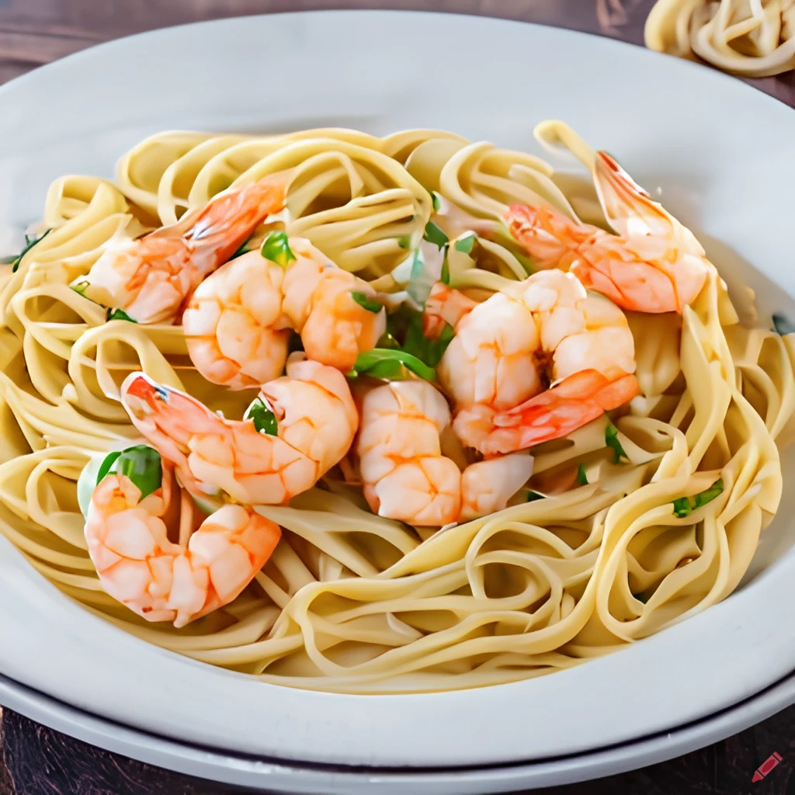

Indulge in a plate of delicious prawn pasta that's quick and easy to make. Perfect for a cozy weeknight dinner or a special occasion, this dish is sure to satisfy your cravings and impress your guests.

## Ingredients

* 200 g linguine or spaghetti;
* 25 g butter;
* 200 g raw peeled prawn, preferably tiger prawns;
* 1 garlic clove, crushed;
* 100 ml white wine;
* Squeeze lemon juice;
* Small handful flat-leaf parsley, roughly chopped.

## Method

STEP 1: Cook the pasta in a large pan of boiling, salted water according to pack instructions. Meanwhile, heat a small knob of the butter in a frying pan. When it starts to sizzle, add the prawns and fry for 1 min until they start to change colour. Add the garlic and sizzle for 1 min more, splash in the wine, then bring to the boil. Swirl in the rest of the butter, season with salt and pepper and a squeeze of lemon juice, then stir in the chopped parsley.

STEP 2: When the pasta is just cooked, drain and toss through the prawns. Divide the pasta between 2 bowls, pour over any excess sauce and serve straightaway.