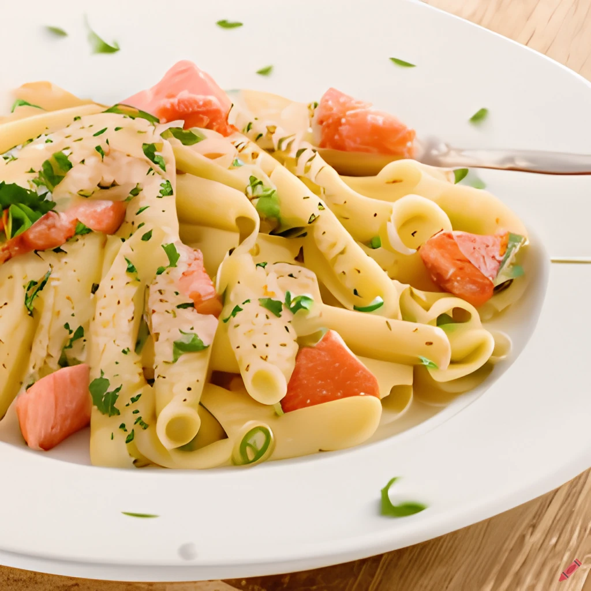

Healthy, comforting and filling, ready in just 30 minutes. Sounds great? It tastes  – try it out yourself.

## Ingredients

* 1 salmon fillet;
* 1/2 tbsp olive oil;
* 100 g penne;
* 1/2 small onion, finely chopped;
* 1/2 garlic clove, crushed;
* 50 ml white wine;
* 100 ml  double cream or crème fraîche; 
* 1/2  lemon, zested and juiced.

## Method

STEP 1: Heat the oven to 200C, place on a baking tray, drizzle with oil and roast for 12 mins until opaque and the flesh starts to flake when pressed. 

STEP 2: While the salmon is cooking, boil the pasta for 10 mins until al dente, then drain, reserving 80 ml of the pasta water.

STEP 3: Heat the oil on a medium heat in a wide frying pan and fry the shallot for 6 mins until softened, but not turning golden. Add the half of the garlic and fry for a minute more until fragrant. Add the wine, bubble for a few minutes until reduced by half, then add the cream and season well. Bring to a very gentle simmer.

STEP 4: Flake the cooked salmon into big chunky pieces, leaving the skin behind. Add to the sauce with the cooked pasta. Add the lemon zest, a squeeze of the juice and most of the dill. Add a splash of the pasta water to the sauce to coat the pasta if you need to. Toss gently to keep the salmon in big pieces. Check the seasoning, if using double cream you may need a squeeze more lemon juice. Grind over some black pepper and scatter over the remaining dill.