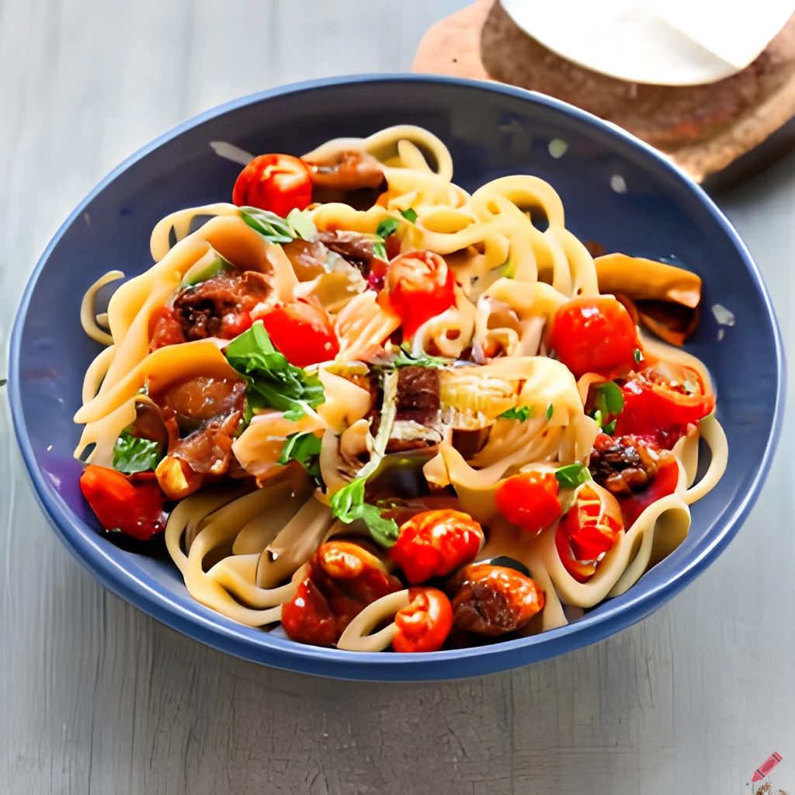

Looking for a hearty and flavorful vegetarian pasta dish? Look no further than this delicious caponata pasta recipe. It's a satisfying and colorful meal that's perfect for a weeknight dinner or a special occasion. Plus, it's vegetarian-friendly and easy to make!

## Ingredients

* 1 tbsp olive oil
* 1 onion, finely chopped
* 1 garlic clove, finely sliced
* 65 g chargrilled Mediterranean veg
* 100 g chopped tomatoes
* 1 tbsp small capers
* 1 tbsp raisins
* 100 g rigatoni, penne or another short pasta shape
* Bunch basil leaves, picked
* Parmesan (or vegetarian alternative), shaved, to serve

## Method

STEP 1: Heat the oil in a large pan and cook the onion for 8-10 mins until starting to caramelise (or for longer if you have time – the sweeter the better). Add the garlic for the final 2 mins of cooking time.

STEP 2: Tip in the mixed veg, tomatoes, capers and raisins. Season well and simmer, uncovered, for 10 mins, or until you have a rich sauce.

STEP 3: Meanwhile, boil the kettle. Pour the kettleful of water into a large pan with a little salt and bring back to the boil. Add the pasta and cook until tender with a little bite, then drain, reserving some of the pasta water. Tip the pasta into the sauce, adding a splash of pasta water if it needs loosening. Scatter with the basil leaves and parmesan, if you like, and serve straight from the pan